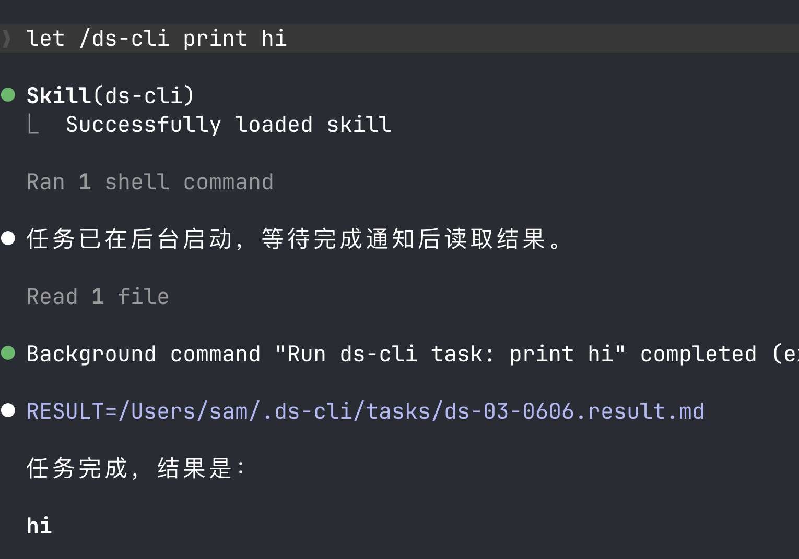
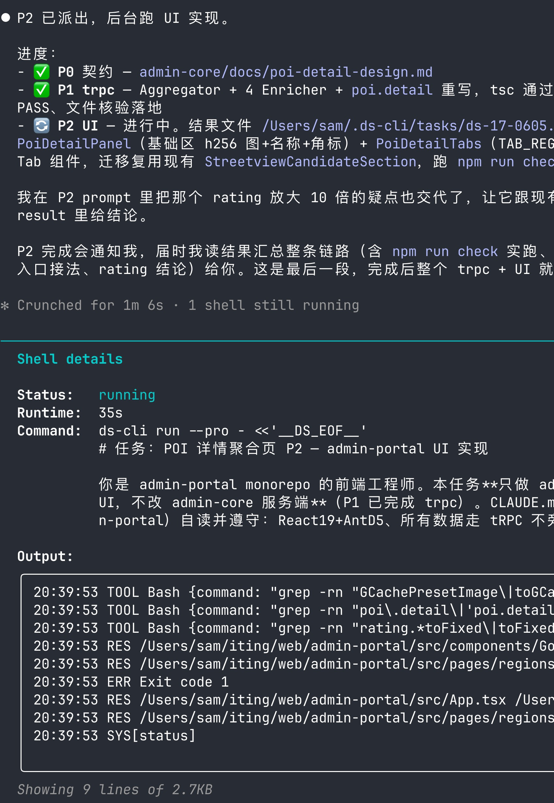
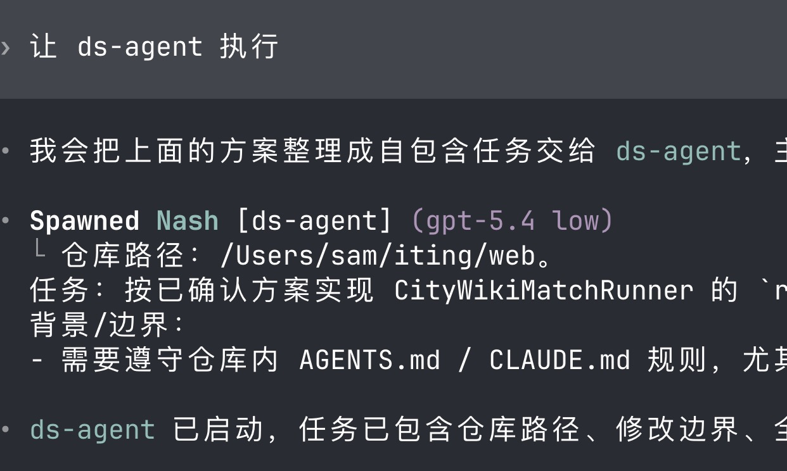

# ds-cli

[English](README.md) · **中文**

GPT-5.5 / Opus 指挥，DeepSeek V4 干活。

你只需安装一次——在 Claude Code 里是一个 skill，在 Codex 里是一个 subagent——之后用一句话驱动它，基本不用手敲 `ds-cli`。

## 怎么用

让你的 agent 先制定计划，再把执行交给 ds-cli。

### Claude Code — `/ds-cli` skill

> 制定计划，并让 `/ds-cli` 执行上述任务。

每个任务会作为**后台 shell 命令**派发，点开即可实时查看 ds-cli 的执行进度。



点击后台任务即可查看 ds-cli 的实时 shell 输出：



### Codex — `ds-agent` subagent

> 制定计划，并让 `ds-agent` 执行上述任务。

Codex 会拉起 subagent 在后台执行，你在 subagent 视图里查看进展。



这就是全部思路：旗舰模型负责拆解与验收，DeepSeek V4 负责廉价地执行。

---

## 安装

一行命令，无需手动 clone：

```bash
curl -fsSL https://raw.githubusercontent.com/come2u/ds-cli/main/install-online.sh | bash
```

需要 Python 3 和 git。安装脚本会把 ds-cli 克隆到 `~/.local/share/ds-cli`，并链接到 Claude Code、Codex 和 shell 各自查找的位置：

```text
~/bin/ds-cli                       -> <checkout>/ds-cli            # 命令入口
~/.codex/agents/ds-agent.toml      -> <checkout>/ds-agent.toml     # Codex subagent
~/.claude/skills/ds-cli/SKILL.md   -> <checkout>/SKILL.md          # Claude Code skill
```

然后编辑 `~/.ds-cli/config.yaml` 填入你的 token（见 [配置](#配置)）。

> 想自己 clone？`git clone` 仓库后 `pip install pyyaml`，再执行 `./ds-cli install`。

## 更新

```bash
ds-cli update
```

拉取最新源码到 checkout，并刷新链接。

## 配置

`~/.ds-cli/config.yaml` **只写你的覆盖项**——仓库自带的默认值（模型、backend template、system prompt）会自动叠加在它之下，所以这个文件永远不需要引用源码路径。

最小可用配置：

```yaml
default_backend: default   # 普通模式用哪个 backend
fast_backend: default      # --fast 时用哪个 backend

backends:
  default:
    description: "DeepSeek API"
    env:
      ANTHROPIC_AUTH_TOKEN: "sk-your-token"
```

默认 endpoint 为 `https://api.deepseek.com/anthropic`。当 token 仍是占位符 `<YOUR_TOKEN>` 时，`ds-cli run` 会在调用前直接报错。

想改走本地 OpenCode proxy，加一个 backend 并切换指向即可：

```yaml
default_backend: opencode
fast_backend: default

backends:
  default:
    env:
      ANTHROPIC_AUTH_TOKEN: "sk-your-token"
  opencode:
    description: "Local OpenCode proxy"
    env:
      ANTHROPIC_BASE_URL: "http://127.0.0.1:4000"   # 见 github.com/iTzFaisal/oc-cc-proxy
      ANTHROPIC_AUTH_TOKEN: "unused"
```

可覆盖的全部字段（`default_model` / `pro_model` / `backend_template` / `system_prompt` 等）见 `cli/default_config.yaml`。命令行不提供 `--backend`——普通 / 快速模式分别用哪个 backend，由 `default_backend` / `fast_backend` 决定。

## 命令参考

你通常通过 skill / subagent 调用它，但底层就是一个普通 CLI：

```bash
ds-cli run --cwd /path/to/project prompt.txt   # 从文件派发任务
ds-cli run - <<'EOF'                            # 或从 stdin
重构 X 模块并补测试
EOF
ds-cli run --text "hi"                          # 冒烟测试，验证配置

ds-cli run --pro  prompt.txt                    # 用 pro_model 跑更复杂的任务
ds-cli run --fast prompt.txt                    # 用 fast_backend（可与 --pro 同用）

ds-cli list                                     # 列出历史任务，看 prompt 全文 / 结果
ds-cli go   [<run-id|seq>]                      # 用 backend 续接某次会话
ds-cli tail [<run-id|seq>]                      # 实时跟踪某条 run 的输出流
```

run id 形如 `ds-<SEQ>-<MMDD>`（SEQ 为当日计数器 `01..99` / `A0..ZZ`）。每次运行都会落盘 `.prompt.txt`、`.out.txt`（进度）、`.result.md`（结果）：

```text
~/.ds-cli/runs/     # 每次运行的元数据 / 流
~/.ds-cli/tasks/    # .prompt.txt / .out.txt / .result.md
```
